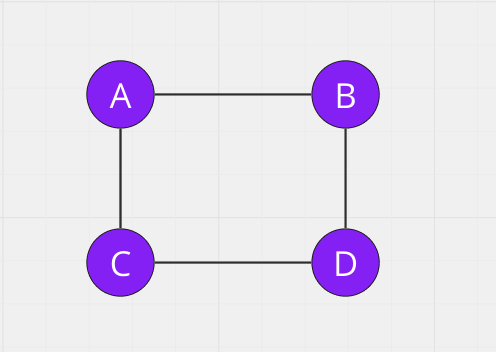
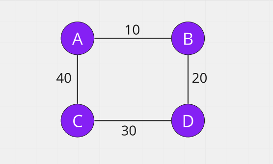
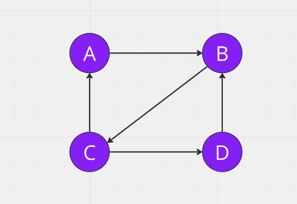
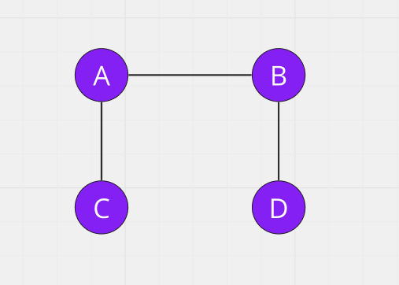
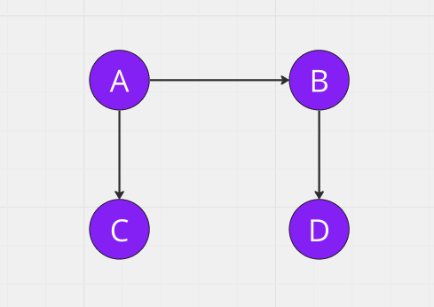

# Graph Theory

## Konigsberg 7 Bridge Problem


Here is the one example of traversal but still one bridge left to visit.

## Undirected Graph
No odd vertices or exactly two odd vertices and all other vertices have even degree.

## Directed Graph
All vertices with nonzero degree belong to a single strongly connected component. 
In degree is equal to the out degree for every vertex.


# Graph Data Stucture

A graph data structure is a collection of nodes that have data and are connected to other nodes.

# Types of graph

## Simple Graph



## Directed Graph


## Undirected Graph


## Weighted Graph

## Cyclic Graph

## Acyclic Graph

## DAG(Directed Acyclic Graph)


## Handshaking Theorem

### Degree

Degree of a vertex of a graph is the number of edges that are incident to the vertex.

### Indegree of a Graph

Indegree of vertex V is the number of edges which are coming into the vertex V.

### Outdegree of a Graph

Outdegree of vertex V is the number of edges which are going out from the vertex V.

Total degree of a graph is equal to twice of the number of edges.
Total degree of a graph = 2E

$\sum deg(g)$ = 2E

# Graph Representation

## Adjacency Matrix


## Adjacency Matrix Code

```
function multiDarray(row, col) {
    return [...Array(row)].map(() => Array(col).fill(0));
}

function main() {
    let [N, E] = readLine().split(' ').map(Number);
    let adjMat = multiDarray(N, N);
    for (let i = 0; i < E; i++) {
        let [u, v] = readLine().split(' ').map(Number);
        adjMat[u][v] = 1;
        adjMat[v][u] = 1;
    }
    console.log(adjMat);
}
```

## Adjacency List


## Adjacency List Code

```
function multiDarray(row, col) {
    return [...Array(row)].map(() => Array(col).fill(0));
}

function main() {
    let [N, E] = readLine().split(' ').map(Number);
    let adjList = [...Array(N)].map(() => new Array());
    for (let i = 0; i < E; i++) {
        let [u, v] = readLine().split(' ').map(Number);
        adjList[u].push(v);
        adjList[v].push(u);
    }
    console.log(adjList);
}
```

<!-- ## Incidence Matrix

 -->

## Adjacency List Bfs

```
function multiDarray(row, col) {
    return [...Array(row)].map(() => Array(col).fill(0));
}

let level = [];
let parent = [];

function getPath(node) {
    let path = [];
    path.push(node);
    while (parent[node] !== -1) {
        node = parent[node];
        path.unshift(node);
    }
    console.log(path);
}

function bfs(adjList, startNode = 0, N) {
    let visited = [...Array(N)].fill(0);
    let q = [];
    let bfsTraversal = [];
    visited[startNode] = 1;
    q.push(startNode);
    parent[startNode] = -1;
    while (q.length) {
        let currentNode = q.shift();
        bfsTraversal.push(currentNode);
        for (let child of adjList[currentNode]) {
            if (!visited[child]) {
                q.push(child);
                visited[child] = 1;
                parent[child] = currentNode;
                level[child] = level[child] + 1;
            }
        }
    }
    console.log('bfsTraversal ', bfsTraversal);
}

function main() {
    let [N, E] = readLine().split(' ').map(Number);
    let adjList = [...Array(N)].map(() => new Array());
    level = [...Array(N)].fill(0);
    parent = [...Array(N)].fill(0);
    for (let i = 0; i < E; i++) {
        let [u, v] = readLine().split(' ').map(Number);
        adjList[u].push(v);
        adjList[v].push(u);
    }
    console.log(adjList);
    bfs(adjList, 0, N);
    getPath(3);
}

// example 1
// 5 4
// 0 1
// 0 2
// 0 3
// 2 4
// output
// bfs traversal  [ 0, 1, 2, 3, 4 ]

// example 2
// 4 4
// 0 1
// 0 3
// 1 2
// 2 3
// output
// bfs traversal  [ 0, 1, 2, 3, 4 ]
```

## Adjacency List Dfs

```
function multiDarray(row, col) {
    return [...Array(row)].map(() => Array(col).fill(0));
}

let visited = [];
let dfsTraversal = [];

function dfs(adjList, startNode = 0) {
    visited[startNode] = 1;
    dfsTraversal.push(startNode);
    for (let child of adjList[startNode]) {
        if (!visited[child]) {
            dfs(adjList, child);
        }
    }
}

function main() {
    let [N, E] = readLine().split(' ').map(Number);
    visited = [...Array(N)].fill(0);
    let adjList = [...Array(N)].map(() => new Array());
    for (let i = 0; i < E; i++) {
        let [u, v] = readLine().split(' ').map(Number);
        adjList[u].push(v);
        adjList[v].push(u);
    }
    console.log(adjList);
    dfs(adjList, 0);
    console.log('dfsTraversal ', dfsTraversal);
}

// example 1
// 5 4
// 0 1
// 0 2
// 0 3
// 2 4
// output
// dfs traversal  [ 0, 1, 2, 4, 3 ]

// example 2
// 4 4
// 0 1
// 0 3
// 1 2
// 2 3
// output
// dfs traversal  [ 0, 1, 2, 3 ]
```
